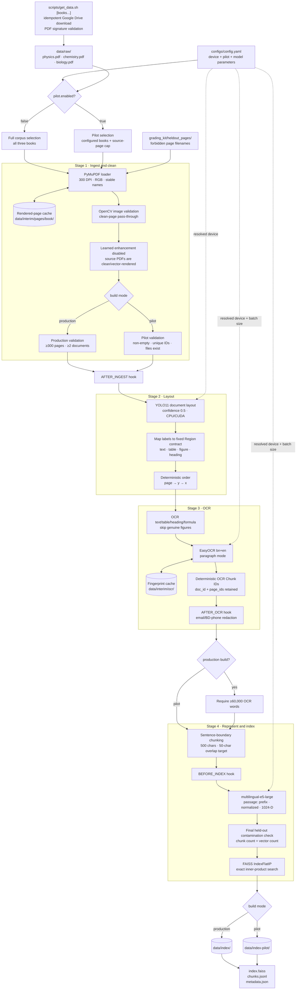

# Knowledge-base pipeline diagram

## Scope and current status

This diagram documents the implemented Stage 0–4 path that builds the knowledge base. Retrieval and agent
stages are intentionally not shown as operational: their interfaces exist, but their main runtime methods
are not implemented yet.

The pipeline has two reversible build modes:

- **Production:** Physics, Chemistry, and Biology; at least 300 usable pages and 60,000 pre-overlap OCR
  words; output under `data/index/`.
- **Pilot:** selected books and a source-page cap; production-size gates are relaxed, but file integrity,
  deterministic provenance, non-empty chunks, matching vector counts, and held-out exclusion remain
  mandatory; output under `data/index-pilot/`.



## Data contracts passed between stages

| Boundary | Contract | Provenance retained |
|---|---|---|
| Ingest → layout | `Page(id, image_path, doc_id)` | Stable rendered path and source book |
| Layout → OCR | `Region(page_id, bbox, kind)` | Exact source page, bounding box, region type |
| OCR → chunking | `Chunk(id, doc_id, text, page_ids)` | Deterministic OCR ID, source book, source page |
| Chunking → embedding/index | `Chunk` plus normalized `float32` matrix | Deterministic final chunk ID and source pages |
| Persisted knowledge base | FAISS index plus JSONL chunks and JSON metadata | Vector order matches chunk order; configuration is hashed |

## Device flow

`device` is resolved once consistently by each model-facing stage:

```text
auto  -> CUDA when torch.cuda.is_available(), otherwise CPU
cpu   -> always CPU
cuda  -> CUDA required; fail clearly when unavailable
```

EasyOCR receives a boolean GPU flag, YOLO receives device `0` or `cpu`, and SentenceTransformer receives
`cuda` or `cpu`. Embedding batches are 16 on GPU and 4 on CPU.

## Persisted build evidence

The current `data/index-pilot/metadata.json` describes a previously generated 50-source-page-request
Physics pilot:

| Measurement | Recorded value |
|---|---:|
| Device | CUDA |
| Usable pages | 47 |
| Detected regions | 305 |
| OCR regions | 254 |
| Pre-overlap OCR words | 9,415 |
| Final chunks/vectors | 295 |
| Embedding dimension | 1,024 |
| Index | FAISS flat inner product |
| Index bytes | 1,208,365 |

The 47-page result is consistent with excluding held-out Physics pages 17, 39, and 40 from the first 50
source pages. This artifact is separate from the later local 20-page pilot attempt: that download was
cancelled before a valid `physics.pdf` was produced, so no fresh 20-page end-to-end result is claimed.

## Verification boundary

The current automated suite reports 21 passing and 9 intentionally skipped tests. The passing tests cover
real temporary-PDF rendering, stable page names, render reuse, held-out exclusion, pilot page limiting,
device selection, deterministic OCR cache behavior with a controlled recognizer, deterministic chunking,
normalized embedding integration with a controlled model, and real FAISS persistence/reload/search. They do
not independently measure real YOLO detection quality, real EasyOCR accuracy, or the unfinished retrieval
and agent stages.
